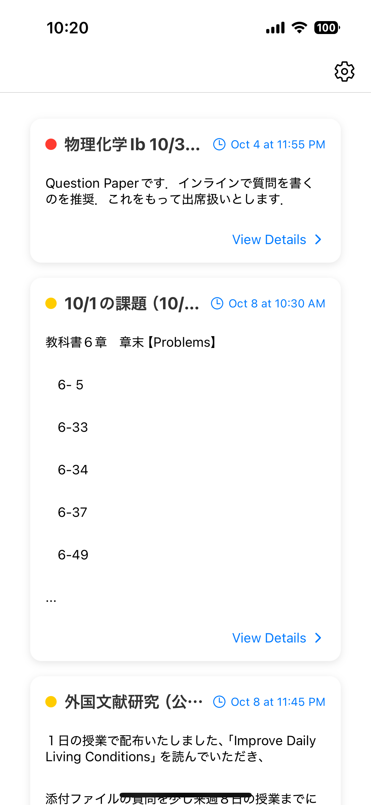
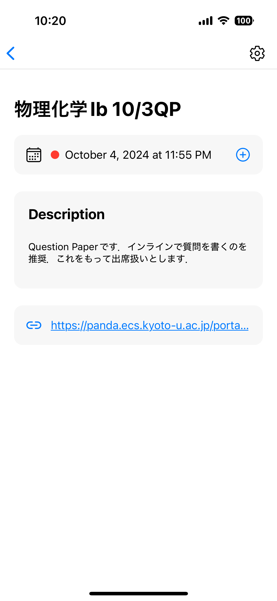

# PandA Mobile

京都大学の授業資料・課題管理システムであるPandAのモバイルアプリ版です。  
課題の閲覧・課題の通知機能を使うことができます。

## 特徴 (Features)

- 課題のリスト表示
- 課題の通知機能

## スクリーンショット (Screenshots)

  
  

## 貢献 (Contributing)

貢献は大歓迎です！プルリクエストを通じて改善提案やバグの修正をお願いします。

## ライセンス (License)

MIT License (MIT). 詳細は[LICENSE](./LICENSE)ファイルをご覧ください。

## 連絡先 (Contact)

何か質問・意見がある場合は、以下の連絡先にご連絡ください。

- Email: navyracooon@gmail.com
- X (Twitter): [@navyracooon](https://twitter.com/navyracooon)

## 免責事項 (Disclaimer)

このアプリは京都大学の公式アプリではなく、学生が作成した非公式のアプリです。

## クレジット (Credits)

このアプリは主に以下のオープンソースライブラリを利用しています  
詳細は `package.json` を参照してください：

- [React Native](https://reactnative.dev/)
- [Expo](https://expo.dev/)
- [@react-navigation/native](https://reactnavigation.org/)
- [@react-native-async-storage/async-storage](https://github.com/react-native-async-storage/async-storage)
- [axios](https://axios-http.com/)
- [react-native-render-html](https://github.com/meliorence/react-native-render-html)
- [date-fns](https://date-fns.org/)
